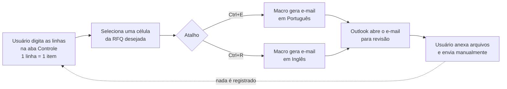
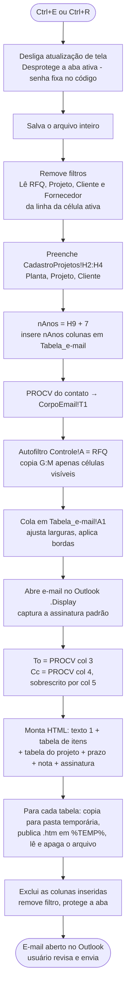

# Análise da planilha legada `RFQ_Controle.xlsm`

> Documento de contextualização do projeto. Descreve a estrutura, as fórmulas, as macros,
> as regras de negócio e os problemas da planilha que o **RFQ Control** vai substituir.
>
> A planilha é classificada como **C2 – Confidential – Internal distribution**. Por isso este
> documento reproduz apenas estrutura, regras e estatísticas agregadas: nomes de pessoas,
> e-mails, fornecedores, clientes e projetos específicos foram omitidos de propósito.

---

## 1. Visão geral

| Item | Valor |
|---|---|
| Finalidade | Controlar as RFQs (*Request for Quotation*) enviadas a fornecedores na fase de cotação de novos projetos e gerar o e-mail de solicitação no Outlook |
| Tipo de compra | Itens de ferramental/automação/dispositivos por projeto (ex.: EOAT, conveyors, gabaritos, dispositivos de controle), cada item com uma referência interna e um CDC (caderno de encargos) |
| Arquivo | `.xlsm` — 6,5 MB compactado, ~112 MB de XML descompactado |
| Estrutura | 6 abas · 11 módulos VBA · 3 tabelas estruturadas · 5 nomes definidos (+ 5 internos quebrados) · 2 vínculos externos |
| Base atual | 1.114 linhas de item · 225 RFQs (`RFQ2026001` a `RFQ2026225`) · 19/03/2026 a 17/09/2026 |
| Cadastros | 16 linhas de projeto (2 plantas, 8 clientes) · 80 fornecedores · 1 solicitante · 112 feriados |
| Origem | Arquivo criado em 2019 e adaptado ao longo do tempo (há resíduos de templates de outras empresas) |

### Como a planilha é usada hoje

---

## 2. Abas

| # | Aba | CodeName VBA | Função | Área realmente usada | Área "suja" (UsedRange) |
|---|---|---|---|---|---|
| 1 | `Controle` | `shControle` | Lista de RFQs/itens (tela principal) | A1:P1115 | **A1:P1048576** |
| 2 | `CadastroProjetos` | `Planilha4` | Cadastro de projetos + solicitantes + área de trabalho da macro | A1:J19 | A1:J61 |
| 3 | `CadastroContatos` | `Planilha2` | Cadastro de fornecedores e e-mails | A1:F311 | **A1:XFD311** |
| 4 | `Feriados` | `Planilha1` | Lista de feriados para cálculo de dias úteis | A1:A112 | A1:E112 |
| 5 | `CorpoEmail` | `Planilha5` | Textos do e-mail (PT e EN) | A1:T26 | A1:T26 |
| 6 | `Tabela_e-mail` | `sh_Tabela_email` | Área temporária da macro | — (deveria estar vazia) | **A1:ACJ528** |

### 2.1 `Controle` — lista principal

Granularidade: **1 linha = 1 item de uma RFQ**. Os dados da RFQ (número, data, solicitante,
projeto, fornecedor) se repetem em todas as linhas de item.

| Col | Cabeçalho | Origem / regra | Visível | Vai no e-mail? | Observações |
|---|---|---|---|---|---|
| A | RFQ Nº | Digitado à mão, padrão `RFQ{AAAA}{NNN}` | Sim | Assunto | Chave usada pela macro para filtrar |
| B | DATA | Digitada (33 linhas com `=$B$675`) | Sim | Não | Data de criação/envio |
| C | SOLICITANTE | Lista suspensa `lst_Buyers` | Sim | Não | Só 1 valor na base |
| D | CLIENTE | `=XLOOKUP(E2;CadastroProjetos!C:C;CadastroProjetos!B:B;"")` | Sim | Assunto + tabela do projeto | **Estendida até ~1 milhão de linhas** (ver §6.1) |
| E | PROJETO | Lista suspensa `lst_Projetos` | Sim | Assunto + tabela do projeto | |
| F | FORNECEDOR | Lista suspensa `CadastroContatos!A2:A1048576` | Sim | Destinatário (PROCV) | |
| G | OP - Ref | Digitado | Sim | **Sim** | Referência interna do item |
| H | CDC - Ref | Digitado | Sim | **Sim** | Referência do caderno de encargos |
| I | PART DESCRIPTION | Digitado | Oculta | Não | Quase vazia (6 linhas) |
| J | UM / QTY | Digitado | Sim | **Sim** | **Mistura unidade (`EA`, `PC`) e quantidade (`154000`)** |
| K | Volume annual | Digitado | Oculta | Não | `NA` em 93 linhas, resto vazio |
| L | *Please confirm 120% capacity… [Y/N]* | Campo para o fornecedor | Oculta | Não | Vazia |
| M | *JUST enter the maximum % coverage* | Campo para o fornecedor | Oculta | Não | Vazia |
| N–O | — | — | Ocultas | Não | Vazias |
| P | RFQ Recebida | Controle de retorno | Oculta | Não | **Nunca preenchida** |

Configurações da aba: linha 1 congelada, autofiltro em `A1:M1035067`, proteção de planilha
com senha (filtro liberado), linhas ocultas por padrão fora da área usada.

**Relação entre linhas, RFQs e "pacotes" (descoberta importante para o novo modelo):**

- 1 RFQ = 1 fornecedor + 1 projeto (apenas 2 exceções na base).
- O **mesmo conjunto de itens** é enviado a vários fornecedores; cada fornecedor recebe um
  número de RFQ próprio.
- As 225 RFQs correspondem a apenas **63 "pacotes" distintos** (projeto + lista de itens),
  enviados em média a **3,6 fornecedores** (mínimo 1, máximo 13).
- Hoje o usuário precisa redigitar/copiar as mesmas linhas de item para cada fornecedor.

### 2.2 `CadastroProjetos`

| Área | Conteúdo |
|---|---|
| `Tabela1` (A1:E23) | `PLANTA OP`, `Cliente`, `Projeto`, `SOP`, `Lifetime (Years)` — 16 projetos; **SOP e Lifetime vazios**; 1 projeto duplicado |
| `Tabela2` (J1:J2) | `Requester` → alimenta o nome `lst_Buyers` |
| G2:H4 | Área de trabalho da macro: rótulos `Planta` / `Projeto` / `Cliente` e valores preenchidos pela macro → vira a "tabela do projeto" no e-mail |
| H8:H9 | `=INDEX(Tabela1[#All];MATCH("<nome de projeto fixo>";Tabela1[[#All],[Projeto]];0);4)` e `…;5)` → SOP e Lifetime de **um projeto fixo digitado dentro da fórmula** |
| H6:H7 | Resíduos de execuções anteriores |
| I18:I19 | Anotações: `CTRL E - PORTUGUES` / `CTRL R - INGLES` |
| Evento VBA | `Worksheet_Deactivate`: ao sair da aba, reordena `Tabela1` por Projeto |

### 2.3 `CadastroContatos`

- Tabela `tbl_SupplierDistributor` (A1:F311): `FORNECEDOR`, `RESPONSÁVEL`, `EMAIL (To)`,
  `EMAIL (Cc)`, `BUYER EMAIL`, `Coluna1`.
- 80 fornecedores preenchidos em 310 linhas (230 linhas vazias dentro da tabela); 1 duplicado.
- `RESPONSÁVEL` = fórmula `=$B$2` em todas as linhas → todos os contatos se chamam "fornecedor".
- Na cópia analisada as colunas de e-mail estão praticamente vazias (2 Cc preenchidos).
- Formatação aplicada até a coluna XFD (última coluna do Excel).
- A macro lê as colunas por posição com `PROCV(fornecedor; A:E; 2..5; 0)`.

### 2.4 `Feriados`

- A1:A112: datas de **01/01/2018 a 25/12/2025**. **Nenhum feriado de 2026 cadastrado.**
- C1:C2 e E1:E2: fórmulas de teste (`=WORKDAY(E1;3;$A$1:$A$112)`).
- Usada pelo cálculo de prazo em `CorpoEmail`.

### 2.5 `CorpoEmail`

| Célula | Uso | Conteúdo / fórmula |
|---|---|---|
| B1 | Texto 1 PT | `="Caro "&S1&"   A <empresa> está atualmente participando de um processo de cotação…"` |
| B2 | Texto 2 PT (prazo) | `="Prazo para retorno "&TEXT(WORKDAY(TODAY();4;Feriados!$A$1:$A$112);"[$-x-sysdate]dddd, mmmm dd, aaaa")` |
| B3 | Texto 3 PT | Nota: enviar cotação conforme documentação, contemplando **CBD e lead time** |
| B4 | Texto 4 PT | Vazio (mas é lido pela macro) |
| B7:B10 | Textos EN | Mesma estrutura em inglês (rótulo da coluna A diz "Corpo espanhol") |
| S1 / S7 | Saudação | Texto fixo `fornecedor` |
| T1 | Nome do contato | Preenchido pela macro — **mas nenhuma fórmula lê T1** |
| M:Q | Listas auxiliares | Meses em inglês e ordinais (1st…31st) — sem uso |

Os textos completos estão em [`02-proposta-sistema.md` §4.3](02-proposta-sistema.md#43-templates-de-e-mail-atuais-a-migrar).

### 2.6 `Tabela_e-mail`

Área de rascunho onde a macro cola os itens filtrados para convertê-los em HTML. Deveria estar
vazia, mas contém **resíduos de execuções interrompidas**: 13 blocos de cabeçalhos antigos
(inclusive de templates de outras empresas, com colunas `EAU Y1…Y6`) espalhados até a coluna
ACJ, **241.896 células vazias formatadas** e 28 regras de formatação condicional órfãs.

---

## 3. Nomes definidos, tabelas e vínculos externos

| Nome | Aponta para | Situação |
|---|---|---|
| `lst_Buyers` | `Tabela2[Requester]` | OK — validação da coluna C |
| `lst_Projetos` | `Tabela1[Projeto]` | OK — validação da coluna E |
| `ssss` | `Tabela1[Projeto]` | Duplicado, sem uso |
| `Componente` | `[1]'Lista Suspensa'!$A$1:$A$20` | Vínculo externo a um arquivo de BOM em SharePoint de outra organização — sem uso |
| `lst_Supplier` | `[2]!tbl_SupplierDistributor[...]` | Vínculo externo a um arquivo local (`C:\Users\...`) de outro usuário — **quebrado** |
| `_FilterDatabase` (CadastroProjetos) | `#REF!` | Quebrado |
| `_xleta.AND/IF/RIGHT` | `#NAME?` | Resíduos |

Validações de dados na aba `Controle`: C (`lst_Buyers`), E (`lst_Projetos`),
F (`CadastroContatos!$A$2:$A$1048576`) — todas aplicadas até a linha 1.048.576.

---

## 4. Macros VBA

Referência obrigatória: **Microsoft Outlook 16.0 Object Library** (Windows + Outlook desktop).

| Módulo | Tipo | Conteúdo | Situação |
|---|---|---|---|
| `EstaPastaDeTrabalho` | Evento da pasta | `Workbook_Open`: registra **Alt+F3** → `Enviar_Email_RFQ_EN` e **Alt+F5** → `Enviar_Email_RFQ_PT`; `Workbook_BeforeClose` desregistra | Alt+F5 chama uma macro **que não existe**; Alt+F3 é ambíguo (2 Subs com o mesmo nome) |
| `mod_email_EN` | Módulo | `Sub Enviar_Email_RFQ_EN` (**Ctrl+E**) + `RangetoHTML` + `RangetoHTMLtab2` | Apesar do nome, gera o e-mail **em português** (B1:B4) |
| `Módulo1` | Módulo | Cópia quase idêntica: `Sub Enviar_Email_RFQ_EN` (**Ctrl+R**) + as mesmas funções | Gera o e-mail **em inglês** (B7:B10) |
| `Mod_email_PT` | Módulo | Só as funções `RangetoHTML`/`RangetoHTMLtab2` (variante com `WSTemp`, nunca atribuído) | Código morto |
| `Mod_Conf_Fonte` | Módulo | `SharePerformance1` — exemplo copiado da internet de e-mail HTML | Código morto |
| `Planilha4` | Evento de aba | `Worksheet_Deactivate` ordena `Tabela1` por Projeto | Funcional |
| `shControle`, `sh_Tabela_email`, `Planilha1/2/5` | Abas | Vazios | — |

Na prática **existe uma única rotina** (`Enviar_Email_RFQ_EN`), duplicada em dois módulos, que
muda apenas as células de texto usadas (PT ou EN).

### 4.1 Passo a passo da macro de e-mail (Ctrl+E / Ctrl+R)

Detalhes relevantes:

1. **Assunto:** `{RFQ} / Customer: {Cliente} / Project: {Projeto}`.
2. **Tabela de itens:** a macro copia `G1:M{última linha}` só com células visíveis. Como
   I, K, L e M estão ocultas, o fornecedor recebe apenas **OP - Ref, CDC - Ref e UM / QTY**.
3. **Tabela do projeto:** `CurrentRegion` a partir de `CadastroProjetos!H2` → `Planta / Projeto / Cliente`.
4. **Colunas dinâmicas (`nAnos`):** a intenção original era adicionar colunas de volume por ano
   conforme o *lifetime* do projeto (`EAU Y1…Yn`), mas como H9 aponta para um projeto fixo com
   lifetime vazio, `nAnos` é sempre 7.
5. **Assinatura:** capturada do Outlook ao exibir o e-mail em branco, concatenada ao final.
6. **Nada é gravado** na planilha: nem data de envio, nem prazo informado, nem status.

---

## 5. Regras de negócio extraídas

| ID | Regra |
|---|---|
| RN01 | Numeração da RFQ: `RFQ` + ano (4 dígitos) + sequencial de 3 dígitos (`RFQ2026001`). Sem lacunas na base atual. |
| RN02 | Cada fornecedor recebe um número de RFQ próprio, mesmo quando os itens são idênticos aos de outro fornecedor. |
| RN03 | O cliente é derivado do projeto (cadastro de projetos). A planta também pertence ao projeto. |
| RN04 | Prazo de resposta = **data de geração + 4 dias úteis**, desconsiderando fins de semana e feriados. |
| RN05 | Idioma do e-mail: Português ou Inglês, escolhido pelo usuário no momento do envio. |
| RN06 | Destinatários: *To* = e-mail do fornecedor; *Cc* = contato em cópia do fornecedor (intenção) + e-mail do comprador. |
| RN07 | Conteúdo do e-mail: saudação, contexto (fase de cotação, não é nomeação), tabela de itens, dados do projeto (planta, projeto, cliente), prazo em destaque, nota pedindo **CBD** e **lead time**, assinatura do usuário. |
| RN08 | O fornecedor deveria confirmar capacidade de **120% do volume anual** (S/N) e informar a **cobertura máxima (%)** — campos previstos, mas hoje ocultos e não enviados. |
| RN09 | O e-mail é revisado pelo usuário antes do envio (não é disparado automaticamente). |
| RN10 | Intenção original: colunas de volume por ano de acordo com o lifetime do projeto (`EAU Y1…Yn`). |

---

## 6. Problemas identificados

### 6.1 Por que a planilha trava — causas-raiz

| # | Causa | Evidência | Efeito |
|---|---|---|---|
| 1 | Coluna D (CLIENTE) estendida até o fim da planilha | **1.033.693 células** com texto vazio para **1.114 linhas reais**; `sheet1.xml` com **106 MB**; UsedRange até a linha 1.048.576 | Abrir, salvar, filtrar e rolar ficam lentos; memória alta; arquivo enorme |
| 2 | Fórmulas com referência de coluna inteira | 3.630 `XLOOKUP(…;CadastroProjetos!C:C;…)` | Recálculo pesado |
| 3 | Lixo na aba `Tabela_e-mail` | 241.896 células formatadas até a coluna ACJ + 28 formatações condicionais | Peso extra em cada abertura/salvamento |
| 4 | `CadastroContatos` formatada até a coluna XFD | Dimensão `A1:XFD311` | Peso extra |
| 5 | Macro salva o arquivo inteiro a cada e-mail | `WBRFQ.Save` no início | Vários segundos parado a cada envio |
| 6 | Macro baseada em Select/Activate, área de transferência, pasta temporária e arquivo `.htm` em disco | `RangetoHTML` ×2 por e-mail | Lento e frágil (qualquer clique/erro interrompe) |
| 7 | Vínculos externos quebrados | 2 links (SharePoint de outra organização e arquivo local de outro usuário) | Avisos/tentativas de conexão ao abrir |
| 8 | Fórmulas voláteis | `TODAY()` em `CorpoEmail` | Recálculo a cada alteração |

### 6.2 Bugs funcionais

| ID | Bug | Impacto |
|---|---|---|
| B01 | `Email_Copia` recebe a coluna 4 (Cc do fornecedor) e é **sobrescrito** pela coluna 5 (Buyer) | O contato em cópia do fornecedor nunca é copiado |
| B02 | Planta = `CadastroProjetos!A{linha selecionada no Controle}` (usa o nº da linha do Controle para ler outra tabela) | Planta errada ou vazia no e-mail (vazia para toda linha > 17) |
| B03 | Nome do contato gravado em `CorpoEmail!T1`, mas a saudação usa `S1`; e `RESPONSÁVEL` é "fornecedor" em todos | Saudação sempre genérica ("Caro fornecedor") |
| B04 | SOP/Lifetime lidos de um projeto fixo dentro da fórmula (H8:H9) | Colunas de volume por ano nunca funcionaram |
| B05 | Alt+F5 chama `Enviar_Email_RFQ_PT`, que não existe; Alt+F3 aponta para um nome duplicado | Erro ao usar os atalhos Alt |
| B06 | `mod_email_EN` gera PT e `Módulo1` gera EN com o mesmo nome de Sub | Manutenção confusa, risco de editar o módulo errado |
| B07 | Data do prazo formatada com a localidade do sistema | E-mail em inglês sai com "terça-feira, 6 de outubro de 2026" |
| B08 | Feriados cadastrados só até 2025 | Prazos de 2026 ignoram feriados |
| B09 | Prazo calculado com `TODAY()` e não gravado | Não há registro do prazo informado ao fornecedor; impossível cobrar atrasos |
| B10 | Sem tratamento de erros (ex.: fornecedor sem cadastro → PROCV falha) | Macro para no meio: colunas ficam inseridas em `Tabela_e-mail`, aba fica desprotegida e filtrada (origem do lixo do §6.1-3) |
| B11 | Cópia só de células visíveis | Descrição, volume, confirmação de 120% e cobertura nunca chegam ao fornecedor |
| B12 | Depende da célula ativa estar na aba `Controle` e na linha certa | Uso errado gera e-mail da RFQ errada ou erro |
| B13 | HTML malformado (`</b></u></i>` sem abertura, `
` sem fechamento) e quebras de linha `\n` dos textos não viram ` ` | Parágrafos "grudados", formatação imprevisível entre clientes de e-mail |
| B14 | `If LR > 2 Then … Else …` com os dois ramos idênticos; objetos Outlook criados em dobro | Código morto |

### 6.3 Qualidade de dados

- **Espaços no fim** de nomes (solicitante, fornecedores, projetos) → buscas falham:
  9 linhas estão sem cliente porque o projeto digitado não bate com o cadastro.
- Coluna **UM / QTY mistura unidade e quantidade** (`EA`, `PC`, `154000`, `999459.99999999977`).
- Erros de digitação em nomes de projeto; projeto e fornecedor duplicados nos cadastros.
- **Número da RFQ e data digitados à mão** — nada impede duplicidade.
- **Status de retorno nunca preenchido** (coluna P) — não há visibilidade de quem respondeu.

### 6.4 Limitações estruturais

- Funciona apenas em **Windows + Outlook desktop** (automação COM); não roda no Excel Online nem no Mac.
- Arquivo `.xlsm` em OneDrive/SharePoint não suporta coautoria plena → conflitos entre usuários.
- Senha de proteção em texto plano no código; a proteção de planilha é facilmente removível.
- Sem histórico/auditoria, sem controle de acesso, sem backup estruturado dos dados.
- Sem indicadores (dashboard), sem comparação de propostas, sem gestão de anexos (CDC, desenhos).

---

## 7. Estatísticas da base atual (agregadas)

| Indicador | Valor |
|---|---|
| Linhas de item | 1.114 |
| RFQs | 225 |
| Pacotes distintos (projeto + itens) | 63 |
| Fornecedores usados / cadastrados | 67 / 80 |
| Projetos com RFQ / linhas no cadastro | 12 / 16 |
| Clientes com RFQ / cadastrados | 5 / 8 |
| Itens por RFQ | 1 a 23 (51 RFQs com 1 item, 56 com 2) |
| Fornecedores por pacote | 1 a 13 (média 3,6) |

RFQs por mês (2026):

| Mar | Abr | Mai | Jun | Jul | Ago | Set |
|---|---|---|---|---|---|---|
| 22 | 12 | 6 | 76 | 87 | 12 | 10 |

---

## 8. Mapeamento planilha → novo sistema

| Planilha | Novo sistema |
|---|---|
| `Controle` (linha = item) | `Pacote de cotação` + `Itens` + `RFQs` (uma por fornecedor), sem repetição de dados |
| Coluna A (RFQ Nº digitado) | Numeração automática e transacional |
| Coluna D (XLOOKUP) | Relacionamento Projeto → Cliente (sem fórmula) |
| Coluna J (UM / QTY) | Dois campos: `unidade` e `quantidade` |
| Colunas K, L, M, P | Campos de resposta do fornecedor e status da RFQ |
| `CadastroProjetos` | Cadastros de Plantas, Clientes e Projetos (com SOP e lifetime) |
| `CadastroContatos` | Fornecedores com N contatos (To/Cc), idioma preferido |
| `Tabela2[Requester]` | Usuários (solicitantes/compradores) |
| `Feriados` | Calendário de feriados por país/planta, com atualização automática |
| `CorpoEmail` | Templates de e-mail por idioma, com variáveis |
| `Tabela_e-mail` + `RangetoHTML` | Geração de HTML direto no servidor (sem área temporária) |
| Macros Ctrl+E / Ctrl+R | Botão "Gerar e-mail" com pré-visualização e escolha de idioma |

A proposta completa está em [`02-proposta-sistema.md`](02-proposta-sistema.md).
