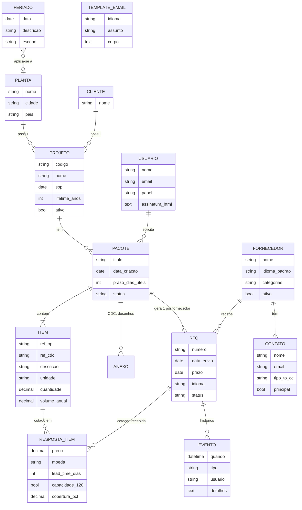
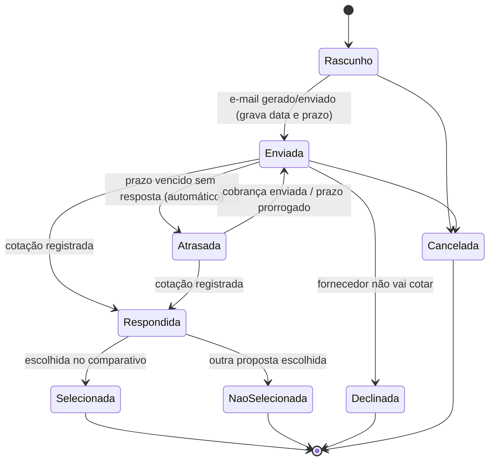
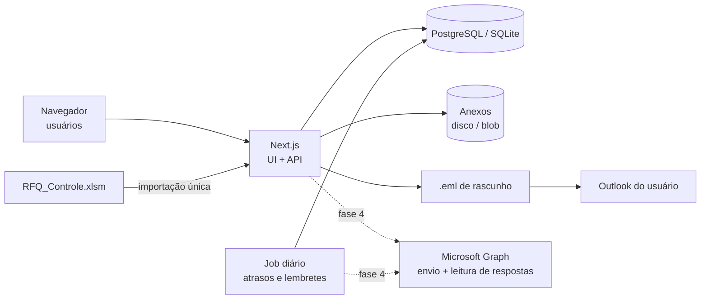

# Proposta do novo sistema — RFQ Control

> Baseada na análise da planilha legada ([`01-analise-planilha-legado.md`](01-analise-planilha-legado.md)).
> Os itens marcados em **Decisões em aberto** (§8) precisam ser confirmados antes de iniciar o código.

## 1. Objetivo

Substituir **por completo** a planilha `RFQ_Controle.xlsm` (fórmulas e macros) por uma aplicação
visual, automática e robusta, que:

- não trava com o crescimento da base;
- elimina digitação repetida (um pacote de itens → várias RFQs, uma por fornecedor);
- gera os e-mails de RFQ sem depender de macros;
- registra tudo o que acontece com cada RFQ (envio, prazo, resposta, cobrança, decisão);
- oferece indicadores, comparação de propostas e acompanhamento de prazos.

## 2. Princípios de projeto

1. **Banco de dados relacional como fonte única da verdade** — nada de fórmulas copiadas por
   milhões de linhas; cliente, planta, prazo, numeração e status são calculados pelo sistema.
2. **Operações atômicas** — uma ação ou acontece inteira ou não acontece; nunca deixa dados "pela metade"
   (ao contrário da macro, que deixa a planilha desprotegida/filtrada quando falha).
3. **Validação na entrada** — campos obrigatórios, listas controladas, espaços removidos,
   unidade separada de quantidade, sem duplicidades.
4. **Auditoria** — toda alteração registra quem, quando e o quê.
5. **Integração com o Outlook sem depender dele** — o e-mail é gerado pelo sistema; o Outlook é
   apenas um dos canais de envio.

## 3. Modelo de domínio

A principal mudança conceitual: a linha da planilha (item repetido por fornecedor) vira três
entidades — **Pacote de cotação** (o que se quer cotar), **Item** (o que está no pacote) e
**RFQ** (o pacote enviado a um fornecedor específico).

### 3.1 Ciclo de vida da RFQ

## 4. Funcionalidades

### 4.1 Paridade com a planilha (MVP)

| ID | Funcionalidade | Substitui |
|---|---|---|
| F01 | Cadastros: Plantas, Clientes, Projetos (SOP, lifetime), Fornecedores com N contatos (To/Cc) e idioma padrão, Usuários, Feriados, Templates de e-mail | Abas de cadastro |
| F02 | Lista de RFQs com filtros, busca, ordenação, agrupamento e paginação no servidor | Aba `Controle` + autofiltro |
| F03 | Criar pacote de cotação: projeto, itens (digitados, **colados do Excel** ou importados), anexos; selecionar 1..N fornecedores → gera N RFQs com numeração automática `RFQ{AAAA}{NNN}` sem duplicidade | Digitação linha a linha + número manual |
| F04 | Gerar e-mail por RFQ (PT/EN, padrão pelo idioma do fornecedor): assunto, saudação com nome do contato, tabela de itens, dados do projeto, prazo calculado com feriados e **formatado no idioma do e-mail**, nota CBD/lead time, assinatura do usuário — com **pré-visualização** | Macros Ctrl+E / Ctrl+R |
| F05 | Entregar o e-mail: (a) arquivo `.eml` de rascunho que abre no Outlook para revisão e envio, com anexos; (b) envio direto via Microsoft Graph/SMTP (fase 4) | `Outlook.Application` via COM |
| F06 | Importar a planilha atual: 1.114 itens → 63 pacotes / 225 RFQs, cadastros e feriados, com relatório de inconsistências (espaços, projeto inexistente, UM/QTY misturado, duplicidades) | — (migração) |
| F07 | Exportar listas e comparativos para Excel | Uso da própria planilha |

### 4.2 Novas mecânicas

| ID | Funcionalidade |
|---|---|
| N01 | **Status e ciclo de vida** da RFQ (§3.1), com data de envio e prazo gravados |
| N02 | **Registro da cotação recebida** por item: preço, moeda, lead time, ferramental, confirmação de capacidade 120% (S/N), cobertura máxima %, validade, anexos (proposta, CBD) |
| N03 | **Comparativo de propostas** por pacote (equalização): tabela lado a lado, destaque de menor preço/lead time, gráfico, escolha do vencedor, exportação |
| N04 | **Follow-up automático**: alerta antes do prazo, marcação de atraso e e-mail de cobrança pronto (template próprio) |
| N05 | **Dashboard**: RFQs abertas/atrasadas/respondidas, taxa e tempo médio de resposta, volume por mês/cliente/projeto/fornecedor, funil de status |
| N06 | **Scorecard de fornecedores**: taxa de resposta, pontualidade, competitividade, RFQs vencidas |
| N07 | **Linha do tempo** de cada RFQ (auditoria completa) |
| N08 | **Anexos por pacote** (CDC, desenhos) incluídos automaticamente nos e-mails |
| N09 | **Feriados automáticos** (nacionais BR/AR via API pública) + feriados locais por planta |
| N10 | **Duplicar pacote** / enviar o mesmo pacote para um novo fornecedor em 1 clique |
| N11 | **Volumes por ano** (EAU Y1…Yn conforme lifetime do projeto) — a intenção original da macro, opcional por pacote |
| N12 | **Login e perfis** (comprador, solicitante, leitura, admin); login corporativo Microsoft na fase 4 |
| N13 | **Leitura da caixa de entrada** (Graph): marca a RFQ como respondida quando chega e-mail com o número dela no assunto (fase 4) |

### 4.3 Templates de e-mail atuais (a migrar)

Variáveis: `{{empresa}}`, `{{contato}}`, `{{rfq}}`, `{{cliente}}`, `{{projeto}}`, `{{prazo}}`,
`{{tabela_itens}}`, `{{tabela_projeto}}`, `{{assinatura}}`.

**Assunto (ambos os idiomas):** `{{rfq}} / Customer: {{cliente}} / Project: {{projeto}}`

**Português**

> Caro {{contato}},
>
> A {{empresa}} está atualmente participando de um processo de cotação junto ao cliente final
> para um novo projeto.
>
> Desta forma, solicitamos o envio da sua melhor proposta comercial para os itens abaixo, a fim de
> suportar a elaboração da nossa oferta ao cliente.
>
> Esta solicitação refere-se exclusivamente à fase de cotação do projeto e não representa uma
> definição de fornecimento ou processo de sourcing neste momento.
>
> {{tabela_itens}} {{tabela_projeto}}
>
> **Prazo para retorno {{prazo}}**
>
> NOTA: Favor enviar a cotação de acordo com as documentações enviadas, contemplando o CBD e lead time.
>
> {{assinatura}}

**Inglês**

> Dear {{contato}},
>
> {{empresa}} is currently participating in a quotation process with the final customer for a new
> project. Therefore, we kindly request the submission of your best commercial proposal for the
> items below, in order to support the preparation of our offer to the customer.
>
> This request refers exclusively to the project quotation phase and does not represent a supplier
> nomination or sourcing process at this stage.
>
> {{tabela_itens}} {{tabela_projeto}}
>
> **Due date {{prazo}}**
>
> Note: Please submit your quotation in accordance with the provided documentation, including the
> CBD and lead time.
>
> {{assinatura}}

Correções já embutidas em relação à macro: saudação com o nome real do contato, Cc do fornecedor
+ comprador, planta correta, prazo formatado no idioma do e-mail e gravado na RFQ, parágrafos
preservados, HTML válido, colunas de descrição/volume/capacidade incluídas quando preenchidas.

## 5. Requisitos não funcionais

| Tema | Requisito |
|---|---|
| Desempenho | Listas paginadas e filtradas no servidor com índices; resposta < 1 s com 100 mil itens |
| Robustez | Transações no banco, validação de esquema na entrada, tratamento de erros com mensagem clara, logs |
| Qualidade | Testes automatizados (unidade, integração e ponta a ponta) e CI no GitHub Actions |
| Dados | Migrações versionadas, backup automático, exportação a qualquer momento |
| Segurança | Autenticação, perfis de acesso, segredos em variáveis de ambiente (nunca no código), dados C2 fora do Git |
| Usabilidade | Interface em PT-BR (e-mails PT/EN), responsiva, atalhos de teclado, tema claro/escuro |
| Multiusuário | Acesso simultâneo sem conflito de arquivo |

## 6. Arquitetura recomendada

**Recomendação: aplicação web full-stack em TypeScript**, com uma única linguagem no front e no
back, tipagem forte de ponta a ponta e um ecossistema maduro para interfaces ricas.

| Camada | Tecnologia |
|---|---|
| Aplicação | Next.js (App Router) + React + TypeScript |
| Interface | Tailwind CSS + shadcn/ui · TanStack Table (grades) · Recharts (gráficos) |
| Banco de dados | PostgreSQL em produção · SQLite para uso local/desenvolvimento · Prisma ORM (migrações) |
| Validação / formulários | Zod · React Hook Form |
| E-mail | Geração MIME/`.eml` (rascunho que abre no Outlook) · Microsoft Graph ou SMTP para envio direto |
| Excel | ExcelJS (importação da planilha legada e exportações) |
| Tarefas agendadas | Job diário para atrasos e lembretes |
| Testes / CI | Vitest · Playwright · GitHub Actions |
| Implantação | Docker (servidor interno ou nuvem) ou execução local |

**Alternativas consideradas**

| Opção | Quando faz sentido |
|---|---|
| Python (FastAPI + SQLAlchemy) + React | Se houver preferência por Python no back-end; mesma arquitetura, duas linguagens |
| Aplicação desktop (Tauri/Electron + SQLite) | Se não for possível hospedar nada e o uso for de uma única pessoa |
| Power Platform (Power Apps + SharePoint/Dataverse + Power Automate) | Se a TI só permitir ferramentas Microsoft 365; low-code, fora do GitHub |

## 7. Roadmap

| Fase | Entregas |
|---|---|
| **0 — Fundação** | Stack e estrutura do repositório, CI, modelo de dados + migrações, dados de exemplo, **importador da planilha** com relatório de inconsistências |
| **1 — MVP (paridade)** | Cadastros, lista de RFQs, criação de pacote → N RFQs, geração de e-mail PT/EN com pré-visualização e `.eml`, feriados, exportação Excel |
| **2 — Acompanhamento** | Status, registro de respostas, prazos/atrasos automáticos, follow-up, dashboard |
| **3 — Análise** | Comparativo de propostas, scorecard de fornecedores, anexos, volumes por ano |
| **4 — Integração** | Login Microsoft (Entra ID), envio via Graph, leitura automática de respostas, notificações |

Ao fim da Fase 1 a planilha pode ser aposentada.

## 8. Decisões em aberto

1. **Onde o sistema vai rodar?** Só no seu computador, em um servidor/nuvem da empresa ou ainda
   não definido? Há restrições da TI (instalar software, hospedar aplicações, Docker)?
2. **Quantos usuários** vão usar ao mesmo tempo (só você, a equipe de compras, outras áreas)?
3. **Stack:** seguir com TypeScript (recomendado) ou prefere Python no back-end?
4. **E-mail:** abrir o rascunho no Outlook (`.eml`) atende no início? Existe possibilidade de a TI
   registrar um aplicativo no Entra ID para usar o Microsoft Graph mais adiante?
5. **Resposta do fornecedor:** quais campos da cotação precisam ser registrados (preço, moeda,
   lead time, ferramental, frete, validade…)?
6. **Feriados:** quais localidades considerar (plantas no Brasil e na Argentina, feriados municipais)?
